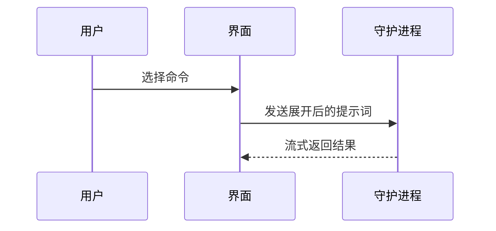

# 图解说明

用视觉方式帮助用户理解当前讨论主题。跳过铺垫，压缩文字，只选择能讲清关键关系的最小视图。

- 用伪代码展示逻辑或算法：

```text
保存
  如果内容没有变化
    返回缓存结果
  写入新内容
  返回最新结果
```

- 用调用树展示运行时控制流：

```text
submitForm
  createSession
    persistPrompt
    launchAgent
  navigateToSession
```

- 用组件树展示 UI 结构，并标出真正影响理解的状态与模块边界：

```tsx
<SessionPage> (apps/example/src/routes/session.tsx)
  useSessionEvents()
  <SessionToolbar>
    <RunSkillButton> (packages/ui)
```

- 用浅层文件树展示文件职责或大范围重构：

```text
src/
├── commands/       # 解析用户操作
├── sessions/       # 管理会话状态
└── transport/      # 发送 API 请求
```

- 用 Mermaid 展示组件交互、控制流或数据流：



- 当重点是已有结构发生了什么变化时使用 `diff`，并让差异形状匹配主题。

组件变化：

```diff
 <SessionPage>
   useSessionEvents()
   <SessionToolbar>
+    <RunSkillButton />
   <SessionTimeline>
+    <SkillResultCard />
```

文件布局变化：

```diff
 src/
 ├── commands/
+│   └── show-me.ts       # 展开斜杠命令
 ├── sessions/
-└── transport.ts
+└── transport/
+    ├── client.ts
+    └── stream.ts
```

调用树或调用栈变化：

```diff
 submitForm
   createSession
     persistPrompt
+    expandSkillMention
     launchAgent
-  navigateToSession
+  navigateToSession
+    subscribeToEvents
```

状态或控制流变化：

```diff
 保存
-  写入内容
+  如果内容没有变化
+    返回缓存结果
+  写入新内容
+  使缓存失效
```

- 当大部分内容都是新的、缺少上下文会隐藏归属或顺序，或用户需要可复制的目标形状时，展示完整代码块：

```ts
function expandSkill(command: string): string {
  const skillName = command.slice(1)
  return `use the ${skillName} skill`
}
```

- 对视觉界面、布局、状态对比，或 Mermaid 难以承载的概念，生成一个聚焦的 HTML 文件。根据内容选择图解、信息图或短幻灯片，不要一次混用全部形式。使用真实标签和数据，匹配产品的颜色、字体、间距与组件，并支持桌面和移动端。

除非用户指定位置，否则把 HTML 写入临时目录，不要污染用户仓库。完成后返回可点击的绝对路径，并在当前宿主支持时直接打开预览。

## 取舍

把每个视觉元素放在它所支撑的简短文字旁边。只保留回答当前问题所需的调用、文件、属性、状态和边界。

可以组合多种视图，但通常不需要全部使用。视图数量一旦超过理解当前问题所需的最小集合，就删掉多余部分。
